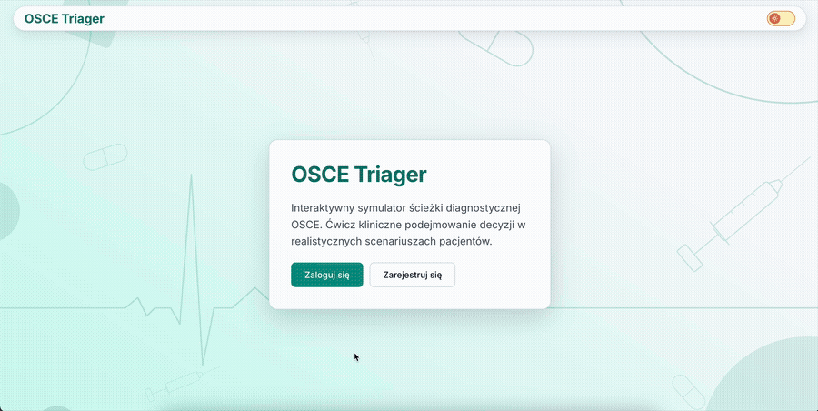
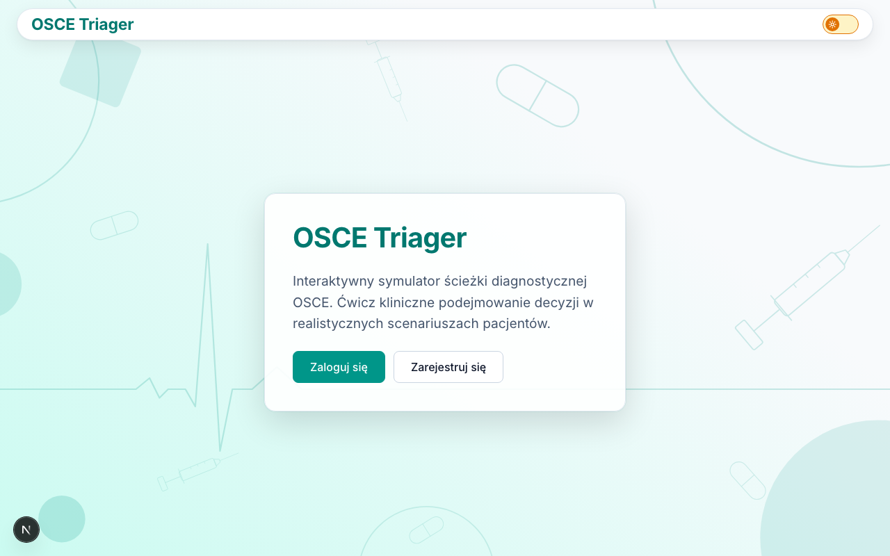
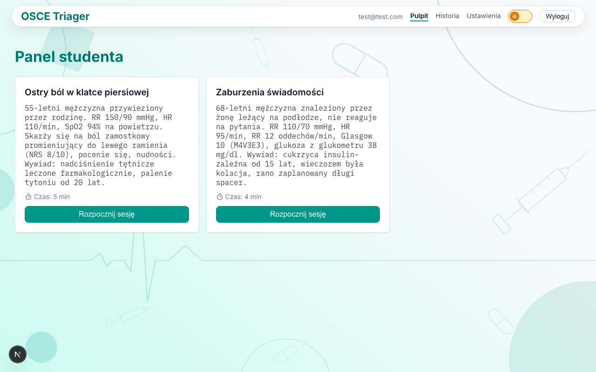
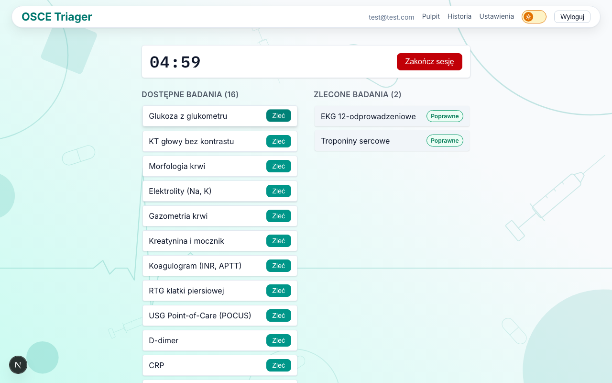
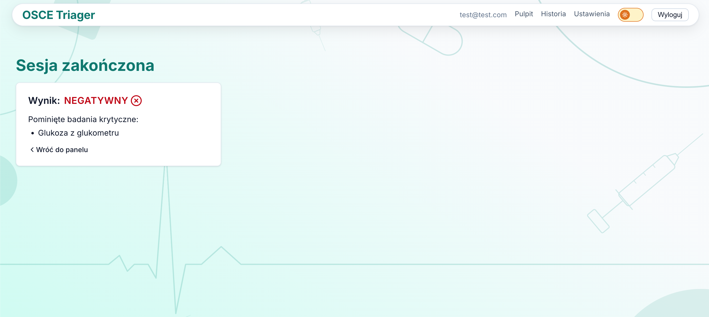
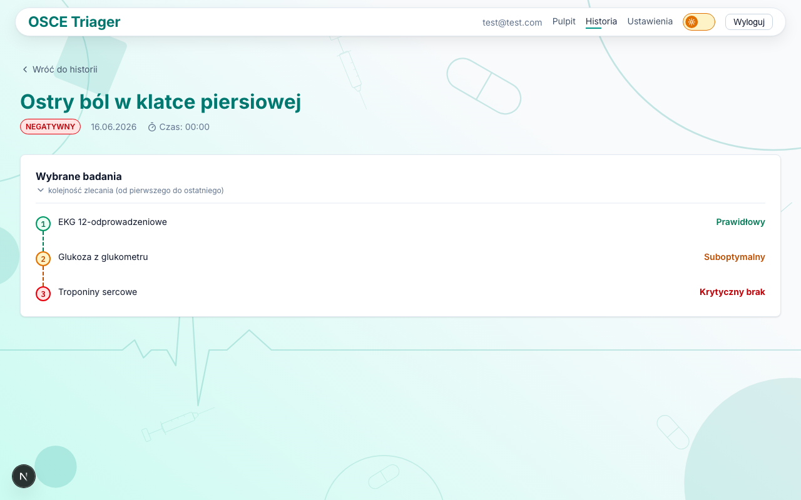
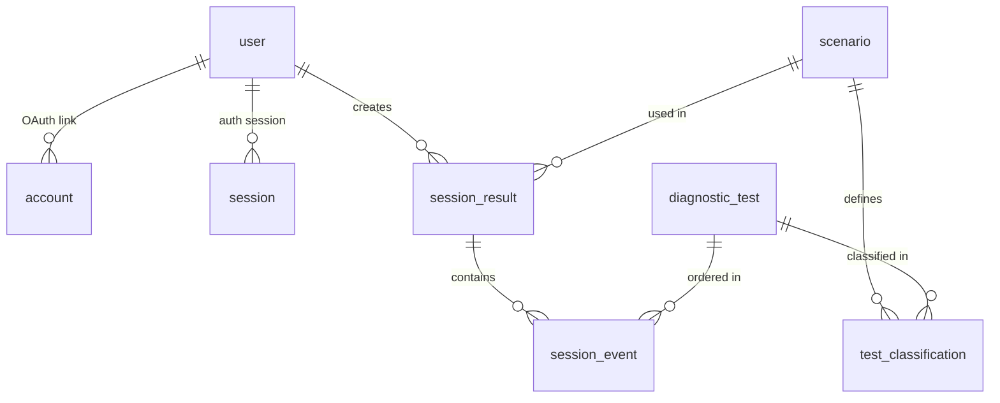

# OSCE Triager

An interactive diagnostic pathway simulator for 6th-year medical students
preparing for OSCE exams.

[](https://github.com/PixelSculptor/osce-traiger/actions/workflows/ci.yml)
[](https://www.typescriptlang.org/)
[](https://nextjs.org/)
[](https://osce-triager.kapix007.workers.dev)
[](LICENSE)

OSCE (Objective Structured Clinical Examination) is the final practical exam for
medical students — a timed, station-based assessment of clinical
decision-making. This simulator lets 6th-year students practice diagnostic
ordering under exam conditions: pick tests from a pool of 18, get real-time
feedback from a validator (Correct / Suboptimal / Unnecessary / Critical miss),
and face the same irreversible penalty as the real exam — a single missed
critical test flips the session outcome to Negative, with no recovery.

---

## Demo

**Live**: https://osce-triager.kapix007.workers.dev









---

## Problem & Context

Medical students in their final year have no dedicated tool to practice clinical
diagnostic algorithms under time pressure with immediate, structured feedback.
Building such a tool requires clinical expertise — creating a gap that OSCE
Triager fills.

The core mechanic: each session presents a real clinical scenario (e.g. acute
chest pain) with a countdown timer. The student orders diagnostic tests from a
pool of 18; after each choice, a real-time validator classifies it:

| Validator result  | Meaning                                      |
| ----------------- | -------------------------------------------- |
| **Correct**       | Optimal or acceptable test for this scenario |
| **Suboptimal**    | Ordered but not the best choice              |
| **Unnecessary**   | Ordered but irrelevant to this presentation  |
| **Critical miss** | A life-saving test was skipped               |

Skipping a critical test locks the session outcome as **Negative** — the student
continues in learning mode but cannot recover the score. This mirrors real OSCE
exam conditions.

---

## Tech Stack

| Area          | Technology                          | Version                        |
| ------------- | ----------------------------------- | ------------------------------ |
| Framework     | Next.js (App Router)                | 16.2.6                         |
| UI            | React                               | 19.2.4                         |
| Language      | TypeScript                          | 5.x                            |
| Auth          | NextAuth.js (Credentials)           | 5.0.0-beta.31                  |
| ORM           | Drizzle ORM                         | 0.45.2                         |
| Database      | PostgreSQL via Supabase             | —                              |
| Deploy        | Cloudflare Workers (OpenNext)       | @opennextjs/cloudflare 1.19.11 |
| Drag-and-drop | @dnd-kit/core + @dnd-kit/sortable   | 6.3.1 / 10.0.0                 |
| Icons         | lucide-react                        | 1.18.0                         |
| Dark mode     | next-themes                         | 0.4.6                          |
| Unit tests    | Vitest                              | 3.2.6                          |
| E2E tests     | Playwright                          | 1.60.0                         |
| CI/CD         | GitHub Actions                      | —                              |
| Styling       | CSS Modules + CSS Custom Properties | —                              |

---

## Key Features

- **Diagnostic session timer** — 2 clinical scenarios (acute chest pain 300s,
  altered consciousness 240s) with a live countdown; timer persists across
  re-renders via server state
- **Real-time validator** — 18 diagnostic tests, 36 per-scenario
  classifications; deterministic feedback on every order action
  (`src/shared/lib/validator.ts`)
- **Drag-and-drop ordering** — reorder queued tests with @dnd-kit; order
  influences the session details review
- **Session history with filtering** — completed sessions listed with outcome
  badge (Positive / Negative), client-side filter by result
- **Session deletion with IDOR guard** — full delete flow with confirmation
  modal; every query is scoped by `user_id` to prevent cross-account access
- **Dual light / dark theme** — explicit `data-theme` attribute driven by
  next-themes; 100+ OKLCH design tokens in `globals.css`
- **GDPR account deletion** — soft-delete with 30-day retention window; nightly
  cron (`cleanup.yml`) hard-deletes expired accounts and cascades across all
  tables
- **Email + password authentication** — bcryptjs hashing, validation in Server
  Actions, credentials provider via NextAuth.js

---

## Architecture

### Domain modules (`src/modules/`)

```
src/modules/
├── auth/       — register, login, logout (Server Actions + NextAuth credentials)
├── session/    — start session, order tests, end session, delete, history
└── account/    — request / cancel account deletion
```

### Shared (`src/shared/`)

```
src/shared/
├── lib/
│   ├── validator.ts   — diagnostic validator (pure function, no side effects)
│   ├── schema.ts      — Drizzle schema: 4 auth tables + 5 domain tables
│   └── db.ts          — per-request Drizzle client factory `getDb()` (server-only, workerd-safe)
└── components/        — Button (4 variants), Spinner, Nav, ThemeToggle, ConfirmModal
```

### Key technical decisions

1. **Server Actions instead of REST API** — no API routes for domain operations;
   forms connect directly to the database via typed Server Actions, eliminating
   an entire network layer
2. **Server-only query modules** — `queries.ts` files import `server-only` and
   are consumed exclusively from Server Components, preventing accidental
   client-side DB access
3. **Edge-compatible middleware** — `middleware.ts` runs on the Cloudflare
   Workers Edge runtime; NextAuth config is split into `auth.config.ts`
   (Edge-safe, no Node.js-only imports) and `auth.ts` (full Node.js, used in
   Server Actions only)
4. **CSS design tokens** — 100+ custom properties in `globals.css` (OKLCH
   colours, 4px spacing grid, Inter + IBM Plex Mono, motion tokens); dark mode
   is a single `data-theme` swap
5. **IDOR guard on every query** — every database read appends
   `AND user_id = session.user.id`; no shared mutable state between users
6. **Per-request DB client** — there is no module-level `db` singleton; the only
   access pattern is the `getDb()` factory in `db.ts`, memoized with React
   `cache()` so the postgres-js socket + Drizzle client are built once per
   request and never reused across requests (a hard requirement on the workerd
   runtime). Connection hardening: `max: 3`, `prepare: false`,
   `fetch_types: false`, `connect_timeout: 10`, `idle_timeout: 20`. These pair
   with the Supabase pooler in **transaction mode (port 6543)** —
   `prepare: false` is required because transaction-mode pooling does not
   support prepared statements

---

## Database Schema



### Auth tables (NextAuth)

`user`, `account`, `session`, `verificationToken`

### Domain tables

| Table                 | Key columns                                                                                                            |
| --------------------- | ---------------------------------------------------------------------------------------------------------------------- |
| `scenario`            | `id`, `title`, `description`, `time_limit_seconds`                                                                     |
| `diagnostic_test`     | `id`, `name`                                                                                                           |
| `test_classification` | `scenario_id` FK, `test_id` FK, `classification` enum(`critical`\|`optimal`\|`acceptable`\|`unnecessary`) — PK on pair |
| `session_result`      | `user_id` FK, `scenario_id` FK, `outcome` enum(`in_progress`\|`positive`\|`negative`), `is_failed`                     |
| `session_event`       | `session_id` FK, `test_id` FK, `validator_result` enum(`correct`\|`suboptimal`\|`unnecessary`\|`critical_miss`)        |

Migrations: `drizzle/migrations/` (3 SQL files, applied by `drizzle-kit migrate`
in the deploy pipeline).

---

## Testing

| Category           | Count  | Tool              |
| ------------------ | ------ | ----------------- |
| Unit / Integration | 35     | Vitest 3.2.6      |
| E2E                | 10     | Playwright 1.60.0 |
| **Total**          | **45** | —                 |

### 8 business risks covered

1. Silent default `"unnecessary"` result with empty classification map —
   `validator.test.ts`
2. Cross-account IDOR (Student B reads Student A's sessions) — `queries.test.ts`
3. Silent session write failure to DB — `actions.test.ts` (hermetic +
   `vi.spyOn`)
4. Broken drag-and-drop for first / last item — `SessionView.reorder.test.ts`
5. Soft-deleted account survives 30-day retention window — `cleanup.test.mjs`
6. Middleware silently passes unauthenticated requests — `auth-boundary.spec.ts`
7. Full E2E diagnostic flow uncovered — `session-flow.spec.ts`
8. Auth setup loads saved state instead of filling the login form —
   `login-form.spec.ts`

---

## CI/CD Pipeline

### `ci.yml` — triggered on every PR to `main`

Four parallel jobs (all depend on `lint-typecheck`):

| Job                 | What it does                                                      |
| ------------------- | ----------------------------------------------------------------- |
| `lint-typecheck`    | ESLint 9 + `tsc --noEmit`                                         |
| `unit-tests`        | Vitest unit suite                                                 |
| `integration-tests` | Vitest integration suite with local Supabase + `drizzle-kit push` |
| `e2e-tests`         | Playwright suite — full build + seed data                         |

### `deploy.yml` — triggered on push to `main`

1. `drizzle-kit migrate` against production database
2. Lint + typecheck
3. `npm run deploy` → Cloudflare Workers via OpenNext

### `cleanup.yml` — cron `0 2 * * *` (02:00 UTC daily)

Deletes accounts where `deletion_requested_at < NOW() - 30 days`, cascades
across `session_result`, `session_event`, and `verificationToken`.

---

## Local Development

**Requirements:** Node.js ≥ 22, Supabase CLI

```bash
npm install
npm run prepare        # prepare husky

# Create .env.local with:
# DATABASE_URL, AUTH_SECRET, NEXT_PUBLIC_SUPABASE_URL,
# NEXT_PUBLIC_SUPABASE_ANON_KEY, AUTH_URL

npx supabase start        # start local Postgres + auth services
npx drizzle-kit push      # apply schema to local DB
npm run seed              # seed clinical scenarios and test classifications
npm run dev               # http://localhost:3000

npm run test              # Vitest unit + integration
npm run test:e2e          # Playwright E2E (requires running dev server)
```
